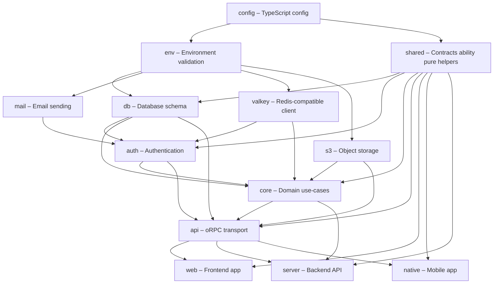

# Monorepo Architecture

This document explains the dependency hierarchy, boundaries system, and development-to-build workflow in this Turborepo monorepo.

## Dependency Hierarchy

The monorepo uses Turbo boundaries to enforce a layered architecture. Each package can only depend on packages below it in the hierarchy.

In the diagram below, arrows point from dependency to dependent — `A --> B` means "B depends on A":

## Package Structure

**Apps:**

- `apps/server`: Backend API (Elysia + oRPC) — depends on `api`, `core`, `shared`, `auth`, `db`, `env`, `s3`, `valkey`, `config`
- `apps/web`: Frontend (React + Vite) — depends on `api`, `shared`, `auth`, `db`, `env`, `config`
- `apps/native`: Mobile app (Expo + React Native) — depends on `api`, `shared`, `auth`, `env`, `config`

**Packages:**

- `packages/config`: TypeScript and build configuration — no workspace dependencies
- `packages/e2e`: Playwright E2E testing — depends on `config`
- `packages/env`: Environment variable validation with Zod — depends on `config`
- `packages/shared`: Zod contracts, CASL ability, roles, Better Auth AC permissions, pure helpers/math, enum constants — depends on `config` (+ catalog libs incl. `better-auth`)
- `packages/db`: Database schema, migrations, Drizzle ORM setup — depends on `shared`, `env`, `config`
- `packages/mail`: Email sending via Resend — depends on `env`, `config`
- `packages/valkey`: Valkey/Redis client, better-auth session adapter, and oRPC rate limiter — depends on `env`, `config`
- `packages/s3`: AWS S3 client for object storage — depends on `env`, `config`
- `packages/auth`: Authentication (Better Auth) — depends on `shared`, `db`, `env`, `mail`, `valkey`, `config`
- `packages/core`: Domain use-cases (product logic) — depends on `shared`, `db`, `auth`, `s3`, `valkey`, `env`, `config`
- `packages/api`: oRPC transport (routers, middleware, context, PowerSync wiring) — depends on `core`, `shared`, `auth`, `db`, `env`, `s3`, `valkey`, `config`

## Boundaries System

Each package declares a tag in its own `turbo.json`. The root `turbo.json` defines `deny` lists — tags a package is forbidden from importing:

| Tag      | Can import from                                                                | Denied imports                                                                               |
| -------- | ------------------------------------------------------------------------------ | -------------------------------------------------------------------------------------------- |
| `config` | _(nothing)_                                                                    | all other tags                                                                               |
| `e2e`    | `config`                                                                       | `db`, `mail`, `valkey`, `auth`, `api`, `core`, `shared`, `web`, `server`, `s3`, `native`     |
| `env`    | `config`                                                                       | `db`, `mail`, `valkey`, `auth`, `api`, `core`, `shared`, `web`, `server`, `s3`, `native`     |
| `shared` | `config`                                                                       | `env`, `db`, `mail`, `valkey`, `auth`, `api`, `core`, `web`, `server`, `s3`, `native`, `e2e` |
| `valkey` | `config`, `env`                                                                | `db`, `mail`, `auth`, `api`, `core`, `shared`, `web`, `server`, `s3`, `native`               |
| `s3`     | `config`, `env`                                                                | `db`, `mail`, `auth`, `api`, `core`, `shared`, `web`, `server`, `native`                     |
| `mail`   | `config`, `env`                                                                | `db`, `valkey`, `auth`, `api`, `core`, `shared`, `web`, `server`, `s3`, `native`             |
| `db`     | `config`, `env`, `shared`                                                      | `mail`, `valkey`, `auth`, `api`, `core`, `web`, `server`, `s3`, `native`                     |
| `auth`   | `config`, `env`, `valkey`, `mail`, `db`, `shared`                              | `api`, `core`, `web`, `server`, `s3`, `native`                                               |
| `core`   | `config`, `env`, `shared`, `db`, `auth`, `s3`, `mail`, `valkey`                | `api`, `web`, `server`, `native`, `e2e`                                                      |
| `api`    | `config`, `env`, `valkey`, `s3`, `mail`, `db`, `auth`, `shared`, `core`        | `web`, `server`, `native`                                                                    |
| `web`    | `config`, `env`, `valkey`, `s3`, `mail`, `db`, `auth`, `api`, `shared`         | `server`, `native`                                                                           |
| `server` | `config`, `env`, `valkey`, `s3`, `mail`, `db`, `auth`, `api`, `shared`, `core` | `web`, `native`                                                                              |
| `native` | `config`, `env`, `valkey`, `s3`, `mail`, `db`, `auth`, `api`, `shared`         | `server`, `web`                                                                              |

This ensures:

- No circular dependencies
- Lower layers never import from higher layers
- `web` / `native` reach `core` only transitively via `api` (package graph). Do **not** import `@lindaflor/core/...` from app source — use `@lindaflor/shared` for contracts/ability/pure helpers and oRPC for server use-cases.
- `web`, `server`, and `native` are mutually excluded at the application layer — they communicate through `api`

## Development Workflow

**`turbo dev`** orchestrates watch mode across all packages:

1. Starts all packages in parallel where possible
2. Watches for file changes
3. Rebuilds dependents when upstream packages change
4. Uses persistent mode (keeps processes running)
5. No caching (always fresh builds)

**Filtered Development:**

- `turbo -F web dev`: Only runs `web` and its dependencies
- `turbo -F server dev`: Only runs `server` and its dependencies
- `turbo -F native dev`: Only runs `native` and its dependencies

## Build Workflow

**`turbo build`** handles incremental production builds:

1. **Dependency Resolution**: Uses `dependsOn: ["^build"]` to ensure upstream packages build first
2. **Build Order**: Config → Env → Shared → Db, Mail, Valkey, S3 → Auth → Core → Api → Web, Server, Native
3. **Caching**: Builds are cached based on inputs/outputs configuration
4. **Outputs**: All builds output to `dist/**` directories

**Key Configuration:**

- `inputs`: `["$TURBO_DEFAULT$", ".env*"]` - invalidates cache when these change
- `outputs`: `["dist/**"]` - build artifacts location
- `dependsOn: ["^build"]` - ensures dependencies build before dependents

## Docker Images

The monorepo produces optimized Docker images for web and server. The native app is distributed through app stores and is not containerized.

**Server Image:**

- **Standalone binary**: Compiled with Bun, runs without Bun runtime (no `node_modules` needed)
- **Minimal base**: Uses distroless/cc-debian12 (non-root, no shell, ~20MB base)
- **Security**: Runs as non-root user (uid 65532) with minimal attack surface
- **Fast startup**: Single binary execution, no dependency resolution overhead

**Web Image:**

- **Static serving**: Pre-built assets served by nginx:alpine (~5MB base)
- **Efficient caching**: Long-lived cache headers for static assets (1 year)
- **SPA routing**: Configured nginx fallback to `index.html` for client-side routing
- **Production-ready**: Optimized Vite build with code splitting and minification

Both images leverage multi-stage builds to exclude dev dependencies, resulting in smaller, faster, and more secure production deployments.

## Why Boundaries Matter

Without boundaries, packages could create circular dependencies or import from wrong layers (e.g., `db` importing `api`). Boundaries ensure:

- **Type safety**: Lower layers don't depend on higher layers
- **Build efficiency**: Clear dependency graph for parallelization
- **Maintainability**: Predictable import paths
- **Architecture clarity**: Enforced separation of concerns
