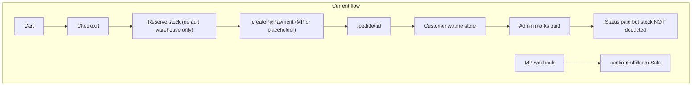
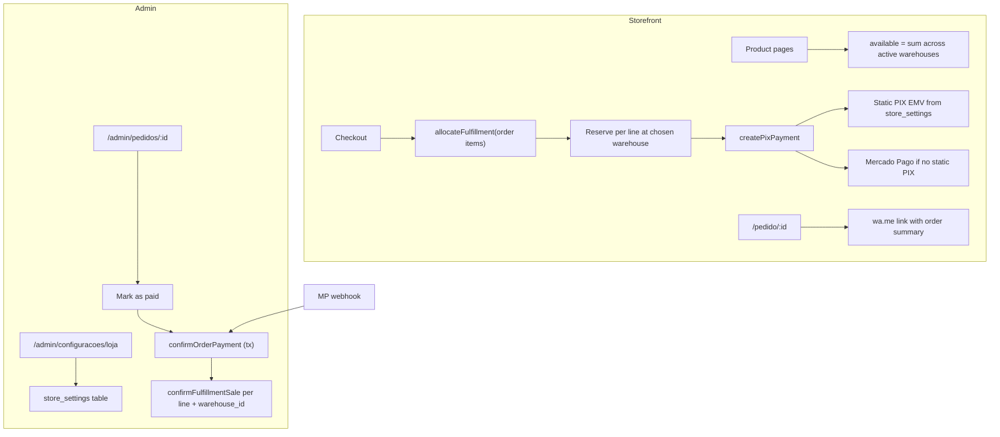
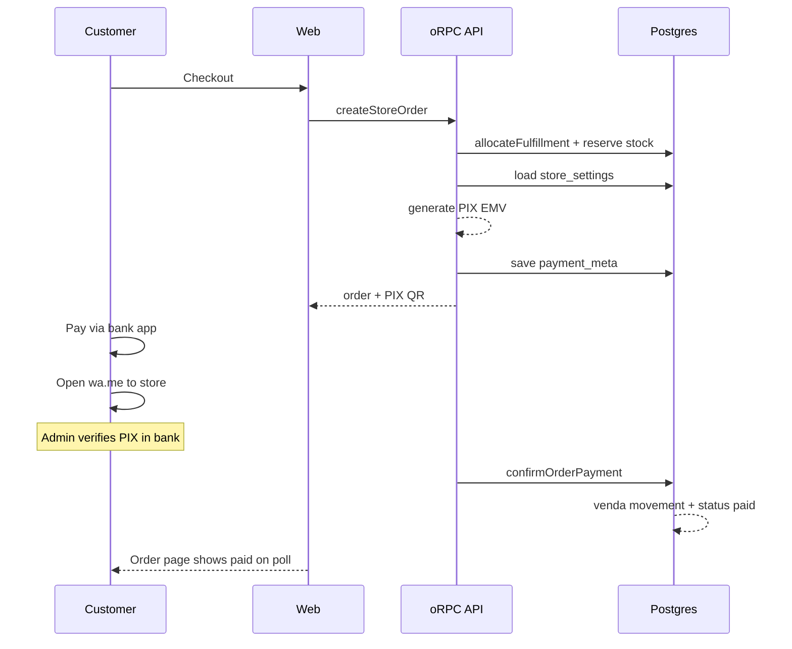

# Stock Control + PIX Brasil — Design Plan

## What you decided

| Topic                | Choice                                                             |
| -------------------- | ------------------------------------------------------------------ |
| Scope                | Full production-ready commerce on top of existing code             |
| PIX primary          | Static PIX key + customer messages store via WhatsApp              |
| PIX fallback         | Mercado Pago when `MERCADO_PAGO_ACCESS_TOKEN` is configured        |
| Payment confirmation | Admin marks order paid in `/admin/pedidos` after WhatsApp contact  |
| Stock scope          | Full multi-warehouse fulfillment (not just default warehouse)      |
| Warehouse selection  | Auto: prefer default, then other active warehouses by availability |
| Reservation window   | 24 hours (keep `ORDER_RESERVATION_HOURS`)                          |
| Admin alerts         | wa.me deep links in admin UI (no WhatsApp Business API)            |
| PIX config           | Admin settings page (DB-backed, editable without redeploy)         |

## Current state (already built)

The repo is **not greenfield**. Substantial commerce exists:

- **Stock:** [`packages/core/src/commerce/inventory.ts`](packages/core/src/commerce/inventory.ts), admin UI at [`apps/web/src/routes/admin/estoque/index.tsx`](apps/web/src/routes/admin/estoque/index.tsx), reserve → pay → deduct lifecycle wired through checkout and payments.
- **PIX checkout:** [`packages/core/src/commerce/payments.ts`](packages/core/src/commerce/payments.ts) creates Mercado Pago PIX when token is set; otherwise a placeholder manual EMV string + WhatsApp link.
- **Critical gaps** blocking production:
  1. Fulfillment is **hard-coded to default warehouse** everywhere (`getDefaultWarehouseId()` in checkout, inventory confirm/release, product availability).
  2. Admin `updateOrderStatus → paid` does **not** call `confirmFulfillmentSale` ([`packages/core/src/commerce/orders.ts`](packages/core/src/commerce/orders.ts) lines 132–159) — stock stays reserved after manual payment.
  3. Static PIX payload is **invalid** (fake EMV string, not generated from a real chave PIX).
  4. No **store settings** table/UI for PIX key, merchant name, WhatsApp number.
  5. **Concurrency risk** on reservation (`reserved += qty` without row lock / available check at update time).
  6. `confirmFulfillmentSale` runs **outside** the payment transaction (uses global `db`, not `tx`).



---

## Approach options (and recommendation)

### A. Static PIX primary + unified payment service (recommended)

Refactor [`createPixPayment`](packages/core/src/commerce/payments.ts) into a strategy:

1. If admin PIX settings are complete → generate valid **EMV BR Code** (copia e cola) + QR from static key, amount, and order txid.
2. Else if `MERCADO_PAGO_ACCESS_TOKEN` → existing MP flow.
3. Else → block checkout with clear admin error (no fake placeholder in production).

Route all paths to `paid` through a single `confirmOrderPayment` (webhook, admin, dev).

**Pros:** Matches your workflow; one code path for stock deduction; MP remains optional.  
**Cons:** Requires correct PIX payload library and admin settings UI.

### B. Keep placeholder manual PIX + admin-only confirmation

Minimal change: improve WhatsApp UX, fix admin-paid bug, skip real EMV generation.

**Pros:** Fastest.  
**Cons:** Customers must type amount/key manually; error-prone; not a real “PIX checkout”.

### C. Mercado Pago primary, static PIX as fallback

Inverse priority of your choice.

**Pros:** Automatic payment confirmation when MP works.  
**Cons:** Contradicts “static PIX primary”; MP fees and onboarding required.

**Recommendation: Approach A.**

---

## Proposed architecture



### 1. Store settings (new)

**DB:** singleton row or key-value table `store_settings` in [`packages/db/src/schema/commerce.ts`](packages/db/src/schema/commerce.ts):

- `pix_key`, `pix_key_type` (`cpf` | `cnpj` | `email` | `phone` | `random`)
- `pix_merchant_name`, `pix_merchant_city` (Bacen EMV fields)
- `whatsapp_number` (E.164, for wa.me links)
- `whatsapp_message_template` (optional, with `{{order_id}}`, `{{total}}` placeholders)

**API:** `commerce.admin.getStoreSettings` / `updateStoreSettings` in [`packages/api/src/routers/commerce.ts`](packages/api/src/routers/commerce.ts) — CASL `manage` on a new `StoreSettings` subject or reuse `Inventory`/`Order` admin grant.

**UI:** [`apps/web/src/routes/admin/configuracoes/loja.tsx`](apps/web/src/routes/admin/configuracoes/loja.tsx) — form to edit PIX + WhatsApp; preview QR.

**PIX generation:** new module [`packages/core/src/commerce/pix-static.ts`](packages/core/src/commerce/pix-static.ts) using a Bacen-compliant library (e.g. evaluate `pix-utils` or `@fnando/pix` under Bun). Generate `pix_copy_paste` server-side; QR as base64 via `qrcode` package on server (or return payload only and render QR client-side with existing `qrcode.react`).

### 2. Multi-warehouse fulfillment

**Schema change:** add `warehouse_id` to `order_items` (nullable for migration, required for new orders).

**New core function** [`packages/core/src/commerce/fulfillment.ts`](packages/core/src/commerce/fulfillment.ts):

```ts
allocateFulfillment(items): Array<{ variant_id, quantity, warehouse_id }>
```

**Algorithm (per order, single warehouse when possible):**

1. Load active warehouses ordered: `is_default DESC`, then `name ASC`.
2. For each warehouse in order, check if `available(variant, warehouse) >= qty` for **all** line items.
3. First warehouse that satisfies the whole cart wins.
4. If none satisfy the full cart, fall back to **per-line allocation**: each line picks default warehouse if available, else warehouse with highest available for that variant.
5. If any line cannot be allocated → `BAD_REQUEST` with product name.

**Storefront availability:** change [`packages/core/src/commerce/products.ts`](packages/core/src/commerce/products.ts) `getFulfillmentAvailable` → `getAvailableTotal` = sum of `(quantity - reserved)` across **active** warehouses (or expose per-warehouse only in admin).

**Checkout** [`packages/core/src/commerce/checkout.ts`](packages/core/src/commerce/checkout.ts): replace hard-coded `getDefaultWarehouseId()` with `allocateFulfillment`; persist `warehouse_id` on each `order_item`; reserve at that warehouse.

**Inventory helpers** [`packages/core/src/commerce/inventory.ts`](packages/core/src/commerce/inventory.ts): change `confirmFulfillmentSale`, `releaseFulfillmentStock`, `reserveFulfillmentStock` to accept `warehouse_id` (read from order item, not default).

**Concurrency fix:** in checkout transaction, use `SELECT … FOR UPDATE` on inventory rows (or conditional update `WHERE quantity - reserved >= :qty`) before incrementing `reserved`.

### 3. PIX payment path (Brazil)

**`createPixPayment` priority:**

1. Load `store_settings`; if `pix_key` present → `provider: "static_pix"`, valid EMV + QR, `ticket_url` = wa.me with pre-filled message.
2. Else if MP token → existing Mercado Pago path (`provider: "mercado_pago"`).
3. Else → throw `SERVICE_UNAVAILABLE` (“Pagamento não configurado”) — do not create order without payment instructions (move PIX creation **inside** checkout transaction or fail order rollback).

**Order page** [`apps/web/src/routes/pedido/$id.tsx`](apps/web/src/routes/pedido/$id.tsx):

- Prominent steps: (1) Copy PIX / scan QR, (2) Pay exact amount, (3) **“Avise no WhatsApp”** button (wa.me).
- Show reservation expiry countdown (24h from `created_at`).
- Poll order status every 30s when `pending_payment` (for MP auto-confirm path).
- Remove or gate dev “simulate payment” behind `import.meta.env.DEV`.

**Admin order detail** [`apps/web/src/routes/admin/pedidos/$id.tsx`](apps/web/src/routes/admin/pedidos/$id.tsx):

- Show fulfillment warehouse per line.
- “Confirmar pagamento” action → calls unified confirm endpoint (not raw status patch).
- wa.me link to message customer: “Recebemos seu PIX para pedido …”

### 4. Unified payment confirmation

**Refactor** [`confirmOrderPayment`](packages/core/src/commerce/payments.ts):

- Accept optional `tx` from caller.
- Load order items **with `warehouse_id`**.
- Idempotent: no-op if already `paid`.
- Run `confirmFulfillmentSale({ variant_id, quantity, order_id, warehouse_id })` inside same transaction.
- Set `status: paid`.

**Wire callers:**

- `updateOrderStatus` when transitioning to `paid` → delegate to `confirmOrderPayment` (not bare status update).
- MP webhook → unchanged entry point.
- Dev webhook → unchanged.

**Post-payment email:** optional `sendPaymentConfirmedEmail` in [`packages/mail`](packages/mail) (lower priority than PIX + stock fixes).

### 5. Stock control hardening (full-warehouse scope)

Beyond multi-warehouse fulfillment, tighten existing admin stock ops:

| Item                                      | Action                                                                       |
| ----------------------------------------- | ---------------------------------------------------------------------------- |
| Admin manual paid bug                     | Fixed via unified `confirmOrderPayment`                                      |
| `saida` movement type unused              | Add `issueInventory` API + “Saída” tab in estoque (shrinkage, gifts, damage) |
| `low_stock_threshold` not editable in UI  | Add inline edit on variant row in admin produtos detail                      |
| Variants without inventory rows invisible | `listInventory` left join + show 0 qty                                       |
| Transaction consistency                   | Pass `tx` through fulfillment helpers                                        |

**Out of scope for v1** (per YAGNI unless you want them in same PR): purchase orders, physical count sessions, warehouse deactivate API, automated low-stock WhatsApp push.

### 6. Admin UX for WhatsApp (wa.me links only)

No outbound API. Surface links:

- **New pending order:** banner on admin dashboard + order list with wa.me to customer (“Olá! Vi seu pedido #…”).
- **Low stock:** each alert row gets optional wa.me to supplier template (manual text).

Store `whatsapp_number` in settings as the **store’s** number shown to customers; admin links use customer phone from shipping address when available, else email-only flow.

---

## Data flow (happy path — static PIX)



---

## Key files to change

| Area                     | Files                                                                                                                                                                |
| ------------------------ | -------------------------------------------------------------------------------------------------------------------------------------------------------------------- |
| Schema + migration       | [`packages/db/src/schema/commerce.ts`](packages/db/src/schema/commerce.ts)                                                                                           |
| Fulfillment allocation   | new `packages/core/src/commerce/fulfillment.ts`                                                                                                                      |
| Checkout / reservation   | [`packages/core/src/commerce/checkout.ts`](packages/core/src/commerce/checkout.ts)                                                                                   |
| Inventory tx + warehouse | [`packages/core/src/commerce/inventory.ts`](packages/core/src/commerce/inventory.ts)                                                                                 |
| Static PIX               | new `packages/core/src/commerce/pix-static.ts`, [`packages/core/src/commerce/payments.ts`](packages/core/src/commerce/payments.ts)                                   |
| Orders admin paid        | [`packages/core/src/commerce/orders.ts`](packages/core/src/commerce/orders.ts)                                                                                       |
| Product availability     | [`packages/core/src/commerce/products.ts`](packages/core/src/commerce/products.ts)                                                                                   |
| API + schemas            | [`packages/api/src/routers/commerce.ts`](packages/api/src/routers/commerce.ts), [`packages/shared/src/schemas/commerce.ts`](packages/shared/src/schemas/commerce.ts) |
| Admin settings UI        | new `apps/web/src/routes/admin/configuracoes/loja.tsx`                                                                                                               |
| Order pages              | [`apps/web/src/routes/pedido/$id.tsx`](apps/web/src/routes/pedido/$id.tsx), [`apps/web/src/routes/admin/pedidos/$id.tsx`](apps/web/src/routes/admin/pedidos/$id.tsx) |
| Estoque saída            | [`apps/web/src/routes/admin/estoque/index.tsx`](apps/web/src/routes/admin/estoque/index.tsx)                                                                         |

---

## Testing plan

- **Unit:** `allocateFulfillment` (default wins, fallback warehouse, partial failure, per-line split).
- **Unit:** PIX EMV payload validation (known test vectors).
- **Integration:** checkout reserves correct warehouse; `confirmOrderPayment` deducts; admin mark-paid same as webhook.
- **Integration:** concurrent checkout on last unit — only one succeeds.
- **E2E:** full static PIX checkout UI → order page shows QR + WhatsApp CTA; admin confirms → status paid + stock reduced.

Run after implementation: `bun run check`, `bun run check-types`, `bun test`, `bun run test-e2e`.

---

## Implementation order

1. **Schema:** `store_settings`, `order_items.warehouse_id`, migration + seed defaults.
2. **Store settings API + admin UI** (unblocks real PIX).
3. **Static PIX generation** + payment strategy refactor.
4. **Fulfillment allocation** + inventory helpers accept `warehouse_id` + tx.
5. **Checkout rewrite** (allocate, reserve with locking, PIX inside tx).
6. **Unified `confirmOrderPayment`** + fix admin paid path.
7. **Storefront/admin UX** (order page, wa.me links, polling, warehouse display).
8. **Stock polish** (saída, low-stock threshold edit, listInventory left join).
9. **Tests + verification.**

---

## Risks and mitigations

| Risk                                                              | Mitigation                                                   |
| ----------------------------------------------------------------- | ------------------------------------------------------------ |
| Invalid PIX EMV                                                   | Use tested library; admin preview QR before save             |
| Split fulfillment across warehouses increases shipping complexity | Prefer single-warehouse orders; show warehouse in admin only |
| Customer pays wrong amount                                        | Order page shows exact BRL; WhatsApp template includes total |
| MP + static PIX both configured                                   | Static wins; document in admin settings                      |
| Migration of existing pending orders without `warehouse_id`       | Backfill with default warehouse_id on migration              |
